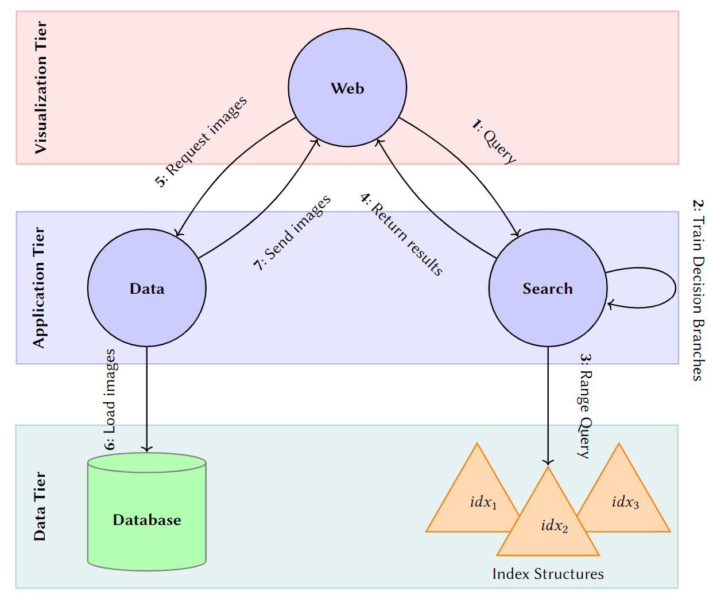

# RapidEarth: A Search-by-Classification Engine for Large-Scale Geospatial Image
In this repository, we present the code for our prototypical search engine **RapidEarth**. A running prototype can be accesed via the following link ([Demo](https://web.rapid.earth/)). 

We provide the code for the three components *Search*, *Data* and *Web* (see Figure). 

  <kbd>
    
  </kbd>

